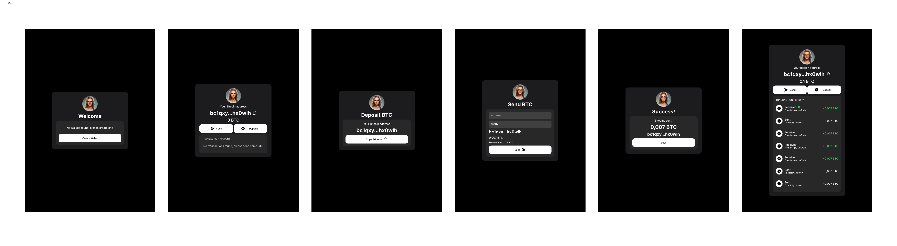

# Bitcoin Testnet Web App

## Description:
This project is a minimalist Web application built using React.js, Next.js, and Redux Toolkit for the Bitcoin Testnet network. Users can create an address, view a list of transactions, and send a specified amount of bitcoins to a given Bitcoin address.

## Libraries Used:
- React.js
- Next.js
- RTK Query
- Tailwind CSS / CSS Modules
- IMask
- react-toastify
- bitcoinjs-lib, @bitcoin-js/tiny-secp256k1-asmjs, ecpair

## Design
[](./design.png)

This is a [Next.js](https://nextjs.org/) project bootstrapped with [`create-next-app`](https://github.com/vercel/next.js/tree/canary/packages/create-next-app).

## Getting Started

First, run the development server:

```bash
npm run dev
# or
yarn dev
# or
pnpm dev
# or
bun dev
```

Open [http://localhost:3000](http://localhost:3000) with your browser to see the result.

